# PyCitySchools with Pandas (Module 4)

[Link to Jupyter Notebook code](PyCitySchools_Challenge.ipynb)

## Overview of School District Analysis

### Purpose
Completed an analysis of High School performance in the District.

Provided the following assessments:

1. A high-level snapshot of the District's key metrics.
2. An overview of the key metrics for each school.
3. Tabular summaries of the following metrics:
	* Average math and reading scores received by students in each grade level at each school.
	* School performance based on budget per student, school size, and type of school.

4. Provided additional assessment to recompute key metrics with a subset removed from the dataset (math and reading scores for ninth graders at Thomas High School).
	* Replaced ninth-grade reading and math scores with NaaN values.
	* Replaced performance scores for Thomas High School with data only including students in grades ten through twelve.
	* Repeated the school district analysis completed in items #1-3 above.

### Resources

This project was prepared using the following:
* Python 3.7.6
* Anaconda 4.12.0
* Jupyter Notebook 6.4.5

* Source data provided by the School District: 

[Link to cleaned student source data](clean_students_complete.csv)

[Link to school source data](schools_complete.csv)

## School District Analysis Results

* How is the district summary affected?
	* The average district-wide math score decreased by 0.1%.
	* The average district-wide reading score increased by 2.9%
	* There was no substantive change in the district-wide percent of students passing math.
	* There was no substantive change in the district-wide percent of students passing reading.
	* There was no substantive change in the district-wide overall passing percent.

Original District Summary

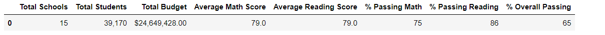

Revised District Summary

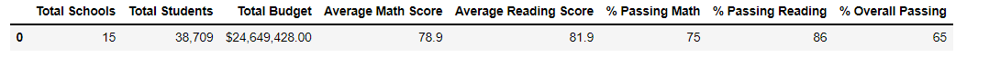

* How is the school summary affected?
	* When the ninth grade test scores were replaced with NaaN values, the overall passing percentage for Thomas High School decreased from 91% to 65%, as demonstrated by the highlighted rows below.  However, after the test scores for Thomas High School were replaced with data for students in grades ten through twelve only, the overall passing percentage increased back to 91%.

Original School Summary

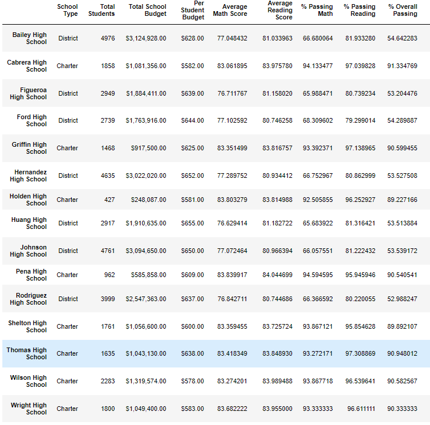

Revised School Summary (Version 1)

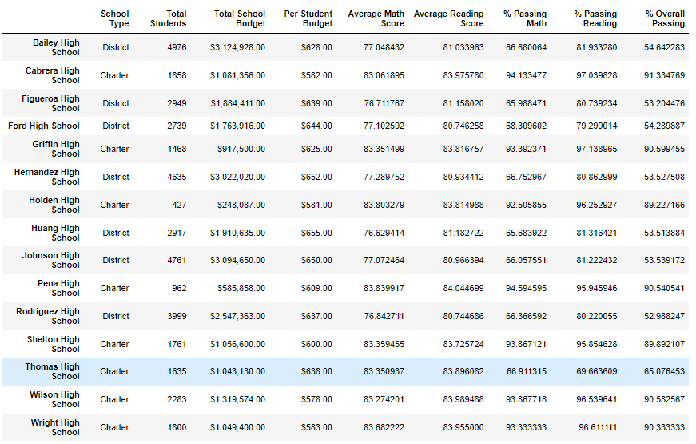

Revised School Summary (Version 2)

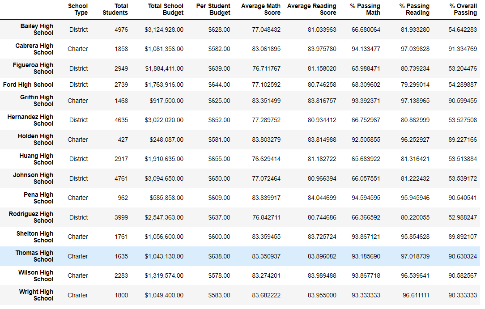

* How does replacing the ninth graders’ math and reading scores affect Thomas High School’s performance relative to the other schools?
	* With the original test score dataset, Thomas High School ranked second in the district for overall student passing percentage.
	* After the test scores for Thomas High School were replaced with data for students in grades ten through twelve only, the school continued to rank second in the district.

* How does replacing the ninth-grade scores affect the following:

* Math and reading scores by grade

Original Math Scores

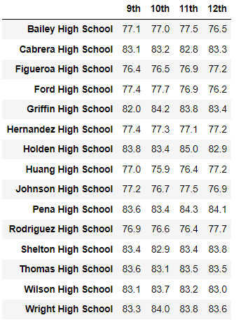

Revised Math Scores

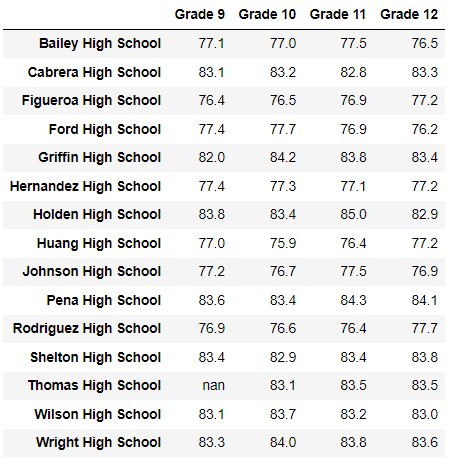

Original Reading Scores

Revised Reading Scores

* Scores by school spending

Original Scores by school spending

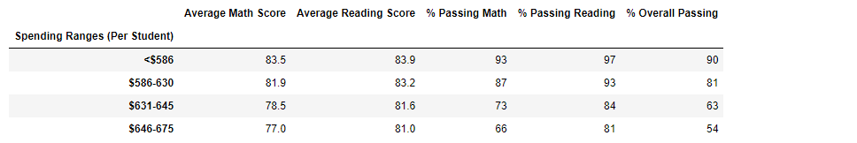

Revised Scores by school spending

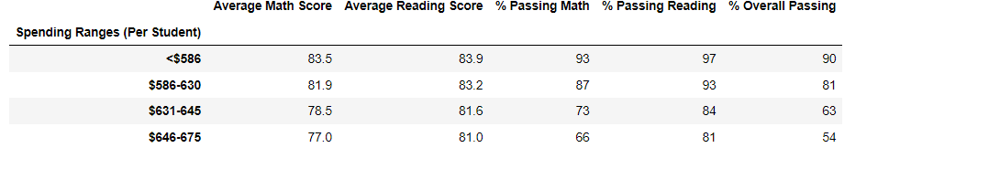

* Scores by school size
	
Original Scores by school size

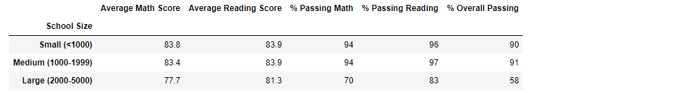

Revised Scores by school size

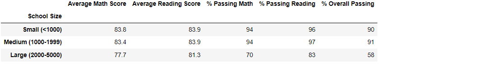

* Scores by school type
	
Original Scores by school type

Revised Scores by school type

## School District Analysis Summary
The following items changed in the school district analysis after reading and math scores for ninth graders at Thomas High School were replaced with NaNs:
1. The number of students inlcuded in the district-wide analays was reduced from 39,170 to 38,709.
2. The average district-wide math score decreased by 0.1%.
3. The average district-wide reading score increased by 2.9%
4. There was no substantive change in the district-wide percent of students passing math or reading.
